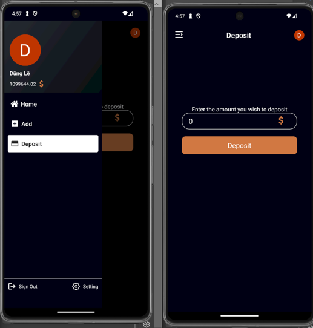

# React Native Coffee Mobile Application 

  

## Table Of Content

- [Introduction](#introduction)
- [Description](#description)

- [Installation](#installation)
- [Usage](#usage)
- [Contributing](#contribution)
- [Tests](#tests)
- [GitHub](#github)
- [Contact](#contact)
- [License](#license)

  

## Introduction

Welcome to the React Native Coffee Mobile Application! This app is designed to provide a seamless e-commerce experience with a beautiful user interface. Whether you're a coffee lover or a business owner, this app has something for you.

   
Login 

In this app, you can explore a wide range of coffee products, add them to your cart, and make purchases with ease. The app also features a history section where you can track your past orders and leave reviews for your favorite products.

With the integration of Firebase and Redux Toolkit, this app ensures smooth and efficient data management. The use of Clerk authentication ensures secure user login and registration.

So why wait? Download the React Native Coffee Mobile Application now and embark on a delightful coffee shopping experience!

## Description

  I created this project to learn React Native, Firebase, and Redux Toolkit, and to improve my front-end JavaScript skills. I built this project because I wanted to familiarize myself with developing an e-commerce application featuring a beautiful UI.

The problems I encountered included handling Clerk authentication, particularly when I updated to Expo 51, which resulted in an error: "Not a valid base64 encoded string length." Additionally, I faced challenges managing Redux Thunk with Firebase and handling data for purchase history.

Through this project, I learned how to integrate Firebase with Redux Thunk to handle asynchronous operations, manage authentication with Clerk, use Redux Toolkit effectively, and implement custom drawer navigation.

This is description details about this project: 

   
Login 

   
Add Product

   
Deposit

   
Home

   
Detail

   
Cart

   
Cart

   
History

   
Review

## Installation

To install this project, follow these steps:

1. Clone the repository to your local machine.

git clone <repository-url>

2. Navigate to the project directory.

cd YuryiCoffeeApp

3. Install the required dependencies.

npm install

Start the React Native server.

npm start

Open another terminal and launch the app on an emulator.

npx react-native run-android

Note: Make sure you have set up the Android development environment on your machine. If not, follow the instructions in the React Native CLI Quickstart guide.

React Native Coffee Mobile Application  is built with the following tools and libraries: 
<ul>
  <li>React</li>
  <li>React Native</li>
  <li>Expo</li>
  <li>React Navigation</li>
  <li>Redux</li>
  <li>Redux Toolkit</li>
  <li>Firebase</li>
  <li>Formik</li>
  <li>Lottie for React Native</li>
  <li>React Native Gesture Handler</li>
  <li>React Native Linear Gradient</li>
  <li>React Native Reanimated</li>
  <li>React Native Responsive Screen</li>
  <li>React Native Safe Area Context</li>
  <li>Ant Design Icons</li>
  <li>Clerk</li>
  <li>Expo Metro Runtime</li>
  <li>React Native Picker</li>
  <li>Base64-js</li>
  <li>Expo Checkbox</li>
  <li>Expo Image Picker</li>
  <li>Expo Linear Gradient</li>
  <li>Expo Status Bar</li>
  <li>TypeScript</li>
</ul>

## Usage
 
To use this project, follow these steps:

1. Start the project:

npm start

2. This will start the Metro Bundler in a new browser tab.

3. You can now run the app on an emulator or a physical device. To do this, use one of the following commands:

For Android:

npm run android

For iOS:

npm run ios

For web:

npm run web

4.In the app, you can navigate through different screens using the navigation menu.

5. The useWarmUpBrowser hook is used to warm up the browser for faster initial page loads.

6. The layoutAverageRating function is used to display the average rating of a product.

7. Firebase is used for backend services. You can interact with Firebase using the exported app object from firebaseConfig.js.

Remember to replace the Firebase configuration in firebaseConfig.js with your own Firebase project details.

## Contribution

App UI   https://www.youtube.com/watch?v=W1Co2M-gsQE

React native with firebase https://www.youtube.com/watch?v=VOFJ1wBJcUo

## Tests
 
no

## GitHub

<a href="https://github.com/Yuryii"><strong>Yuryii</a></strong>

Visit my website: <strong><a href="no">no</a></strong>

## Contact

Feel free to reach out to me on my email:
dungle6604@gmail.com

## License

